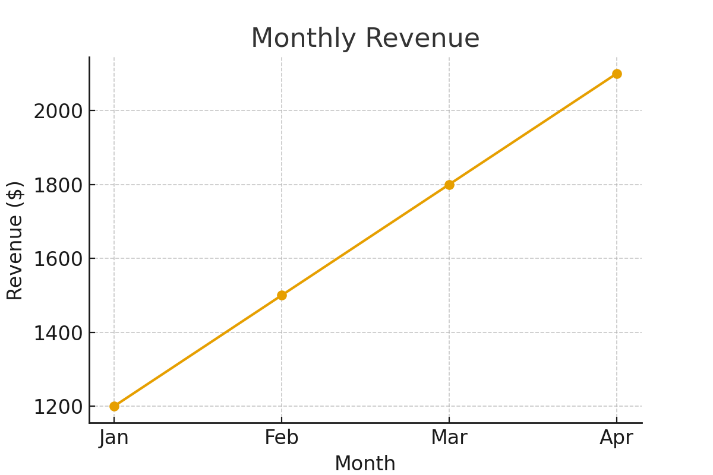
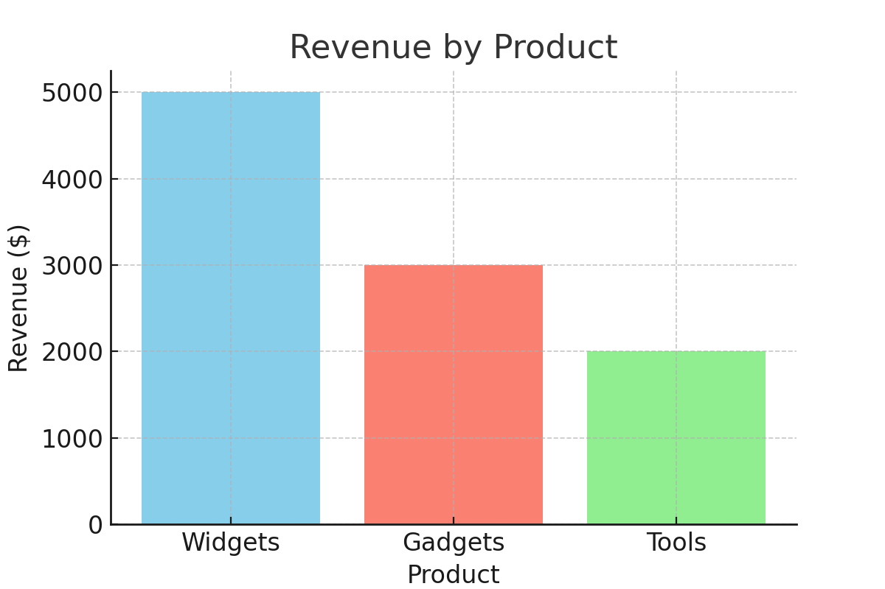

# SQL Sales Analytics

This project explores sales performance using **SQLite + SQL** and visualized with **Python**.

## How to run
```bash
pip install pandas matplotlib
python setup_sqlite.py
python export_charts.py

Insights

📈 Monthly revenue trends upward from Jan to Apr.

💡 Widgets generated the most revenue.

💳 Online channel had the highest average order value (AOV).

## Visuals





